# 펭귄 데이터셋 분석

발표자: 자동 생성 스크립트
날짜: 자동


# 데이터 개요

- Shape: (344, 7)

|    | species   | island    |   bill_length_mm |   bill_depth_mm |   flipper_length_mm |   body_mass_g | sex    |
|---:|:----------|:----------|-----------------:|----------------:|--------------------:|--------------:|:-------|
|  0 | Adelie    | Torgersen |             39.1 |            18.7 |                 181 |          3750 | Male   |
|  1 | Adelie    | Torgersen |             39.5 |            17.4 |                 186 |          3800 | Female |
|  2 | Adelie    | Torgersen |             40.3 |            18   |                 195 |          3250 | Female |
|  3 | Adelie    | Torgersen |            nan   |           nan   |                 nan |           nan | nan    |
|  4 | Adelie    | Torgersen |             36.7 |            19.3 |                 193 |          3450 | Female |


# 결측치 및 요약 통계

|                   |   0 |
|:------------------|----:|
| species           |   0 |
| island            |   0 |
| bill_length_mm    |   2 |
| bill_depth_mm     |   2 |
| flipper_length_mm |   2 |
| body_mass_g       |   2 |
| sex               |  11 |

|       |   bill_length_mm |   bill_depth_mm |   flipper_length_mm |   body_mass_g |
|:------|-----------------:|----------------:|--------------------:|--------------:|
| count |        333       |       333       |            333      |       333     |
| mean  |         43.9928  |        17.1649  |            200.967  |      4207.06  |
| std   |          5.46867 |         1.96924 |             14.0158 |       805.216 |
| min   |         32.1     |        13.1     |            172      |      2700     |
| 25%   |         39.5     |        15.6     |            190      |      3550     |
| 50%   |         44.5     |        17.3     |            197      |      4050     |
| 75%   |         48.6     |        18.7     |            213      |      4775     |
| max   |         59.6     |        21.5     |            231      |      6300     |


# 범주형 변수 분포

```
** species

| species   |   count |
|:----------|--------:|
| Adelie    |     146 |
| Gentoo    |     119 |
| Chinstrap |      68 |

** island

| island    |   count |
|:----------|--------:|
| Biscoe    |     163 |
| Dream     |     123 |
| Torgersen |      47 |

** sex

| sex    |   count |
|:-------|--------:|
| Male   |     168 |
| Female |     165 |
```


# 종별 요약 통계

| species   |   ('body_mass_g', 'mean') |   ('body_mass_g', 'median') |   ('body_mass_g', 'std') |   ('bill_length_mm', 'mean') |   ('bill_length_mm', 'median') |   ('flipper_length_mm', 'mean') |
|:----------|--------------------------:|----------------------------:|-------------------------:|-----------------------------:|-------------------------------:|--------------------------------:|
| Adelie    |                   3706.16 |                        3700 |                  458.62  |                      38.824  |                          38.85 |                         190.103 |
| Chinstrap |                   3733.09 |                        3700 |                  384.335 |                      48.8338 |                          49.55 |                         195.824 |
| Gentoo    |                   5092.44 |                        5050 |                  501.476 |                      47.5681 |                          47.4  |                         217.235 |


# 교차표 및 피봇

```
교차표: species vs sex

| species   |   Female |   Male |
|:----------|---------:|-------:|
| Adelie    |       73 |     73 |
| Chinstrap |       34 |     34 |
| Gentoo    |       58 |     61 |

피봇: species × island 평균

| species   |   ('bill_length_mm', 'Biscoe') |   ('bill_length_mm', 'Dream') |   ('bill_length_mm', 'Torgersen') |   ('body_mass_g', 'Biscoe') |   ('body_mass_g', 'Dream') |   ('body_mass_g', 'Torgersen') |
|:----------|-------------------------------:|------------------------------:|----------------------------------:|----------------------------:|---------------------------:|-------------------------------:|
| Adelie    |                        38.975  |                       38.52   |                           39.0383 |                     3709.66 |                    3701.36 |                        3708.51 |
| Chinstrap |                       nan      |                       48.8338 |                          nan      |                      nan    |                    3733.09 |                         nan    |
| Gentoo    |                        47.5681 |                      nan      |                          nan      |                     5092.44 |                     nan    |                         nan    |
```


# 종별 평균 체중 (g)

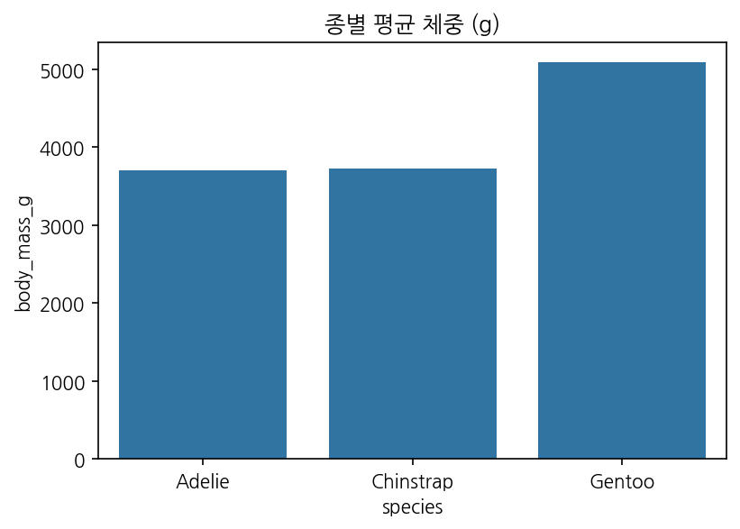

종별 평균 체중 막대는 Gentoo가 현저히 높은 평균 체중을 가지며, Adelie가 가장 낮음을 보여줍니다. 평균 차이는 생태적 지위나 먹이자원 이용 차이를 반영할 수 있으며, 체중의 분산과 표본수를 고려한 신뢰구간 표기는 후속 분석에서 중요합니다. 평균에 대한 단순 비교 외에도, 종 내 분포의 비대칭성이나 이상치를 함께 조사하면 종별 생태적 특성을 더 잘 이해할 수 있습니다. 또한 체중 예측 모델에 지느러미 길이 등 다른 변수를 포함해 설명력을 평가해볼 것을 권장합니다.


# 부리 길이 vs 지느러미 길이 (종/성별)

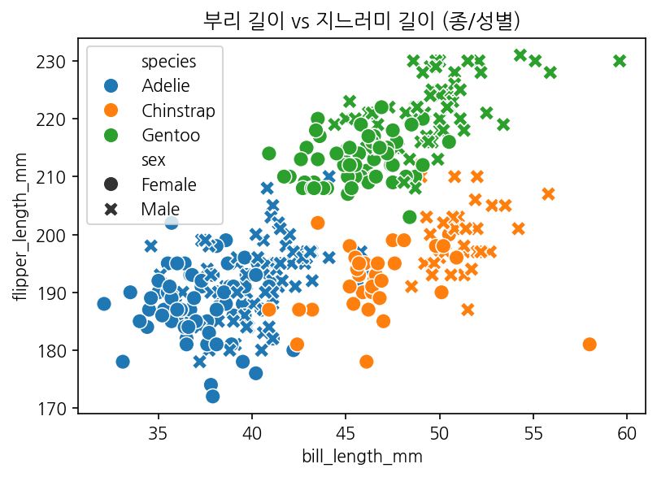

부리 길이와 지느러미 길이 산점도는 두 형태학적 변수 간의 관계를 시각화하며, 색상(hue)으로 종을 구분해 종간 관계 차이를 관찰할 수 있습니다. 상관이 있는 경우 한 변수를 통해 다른 변수를 부분적으로 예측할 수 있으며, 종별 분포의 기울기 차이는 형태적 비율의 차이를 시사합니다. 성별(style) 차이를 함께 표시하면 성별에 따른 형태 차이(성적 이형성)도 탐지할 수 있어 생태적·행동학적 해석에 유용합니다.


# 지느러미 길이와 체중 회귀

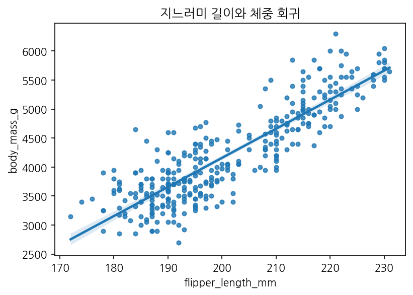

회귀 플롯은 지느러미 길이와 체중 사이의 양의 선형관계를 시사합니다. 기울기와 산포를 통해 지느러미 길이의 변화가 체중 변화에 어느 정도 영향을 주는지 가늠할 수 있으며, 잔차의 패턴을 확인해 비선형성이나 이분산 여부를 검토해야 합니다. 더 정밀한 분석을 위해 종별 또는 성별로 분리해 회귀계수를 비교하거나 다중회귀를 통해 다른 변수의 영향을 통제하여 설명력을 평가할 것을 권장합니다.


# 수치 변수 페어플롯

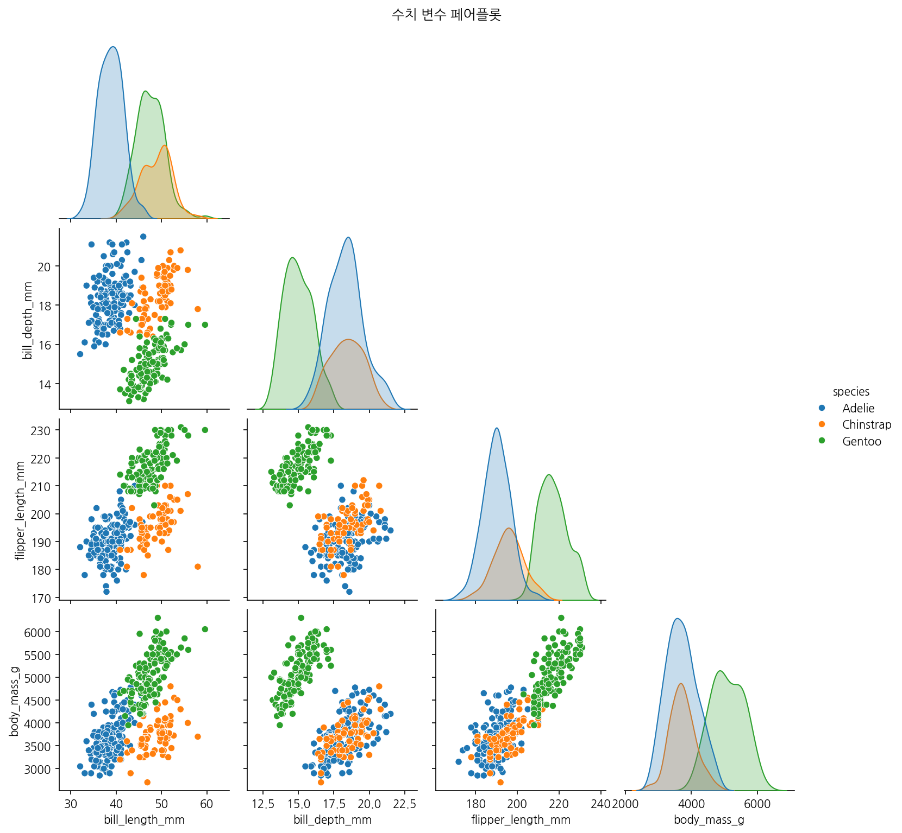

페어플롯은 수치 변수 간의 전반적 관계와 분포를 한눈에 보여주어 변수들 간 상관 구조를 탐색하는 데 유용합니다. 대각선에는 각 변수의 분포가, 비대각선에는 변수쌍의 산점도(또는 밀도)와 종별 색상 구분이 나타나며, 이를 통해 유의미한 관계 또는 다중공선성 우려 변수들을 식별할 수 있습니다. 탐색 결과를 바탕으로 회귀모형의 변수 선택, 차원축소(PCA) 혹은 상호작용 항 검토 등의 후속 작업을 설계할 수 있습니다.


# 수치 변수 상관관계


상관 히트맵은 수치 변수 간의 상관계수를 시각적으로 제시하며, 지느러미 길이와 체중 사이의 강한 양의 상관 등 유의한 관계를 한눈에 파악할 수 있습니다. 높은 상관 관계는 예측모형에서 중요한 피처가 될 수 있으나, 변수 간 다중공선성은 회귀모형의 해석성을 저해하므로 주의해야 합니다. 상관은 인과를 의미하지 않으므로, 추가적인 실험적/도메인 지식을 바탕으로 해석을 보완해야 합니다.


# 종별 부리 길이 스웜플롯

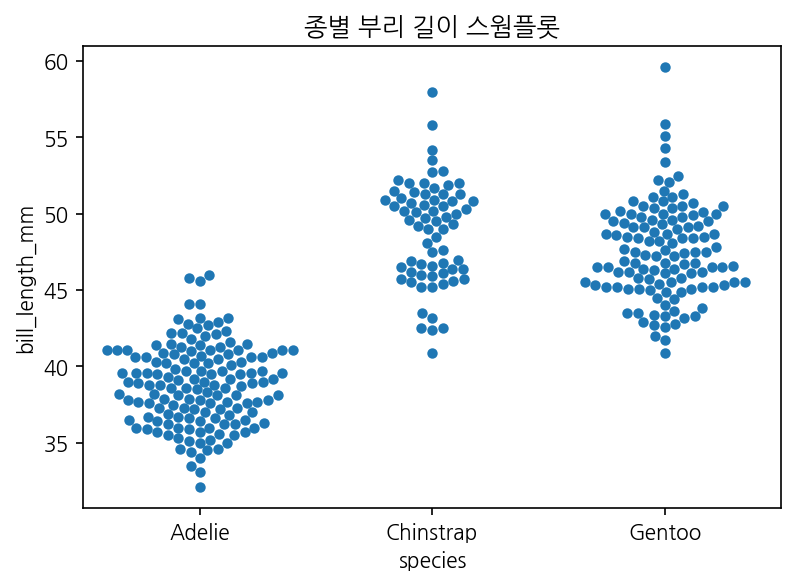

스웜플롯은 각 개체 점을 보여주어 분포의 밀도와 이상치를 동시에 파악할 수 있으며, 종별로 개체 분포의 겹침 여부를 확인할 수 있습니다. 점들의 분포가 넓을수록 군집 내 변이가 큼을 의미하며, 종 간 중첩은 서로 다른 종이 유사한 형태적 특성을 공유할 가능성을 시사합니다. 세부 관찰을 통해 표본의 균질성 여부와 개체 수준의 특이치를 확인하는 데 유리합니다.


# 섬별 부리 길이 분포

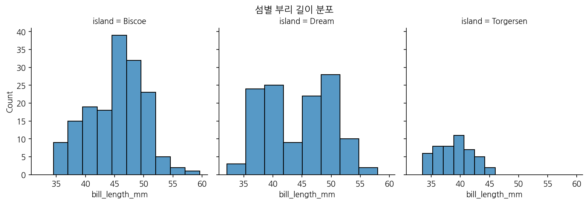

섬별 분포를 보여주는 Facet 그래프는 지역적 특성이 형태에 미치는 영향을 탐색하는 데 유용합니다. 특정 섬에서 우세한 종이 존재하거나 평균 부리 길이가 상이하게 나타나면, 그 섬의 생태적 조건(먹이, 지형 등)이 종 분포와 형태에 영향을 준다는 가설을 세울 수 있습니다. 섬 간 비교는 보전 전략이나 생태학적 연구 설계에 중요한 단서를 제공하므로, 지역별 표본 수와 수집 시기 등을 고려한 추가 검증이 필요합니다.


# 섬별 종 개수 (그룹화 막대)

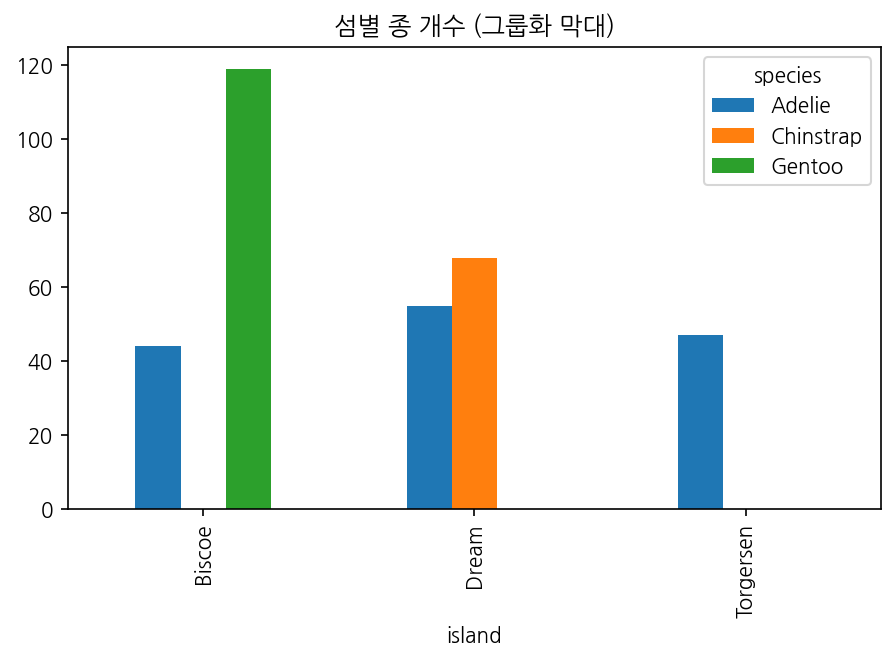

그룹화 막대그래프는 각 섬에 존재하는 종의 상대적인 빈도를 보여주어 섬별 종 구성의 차이를 직관적으로 드러냅니다. 예를 들어 특정 섬에서 Gentoo가 우세하다면 해당 섬의 환경이 Gentoo의 생태적 요구를 충족시키는 것으로 해석할 수 있습니다. 정량적 비교를 위해 교차표 및 통계적 검정을 병행하면, 관찰된 차이가 우연인지 유의한 패턴인지 판단할 수 있습니다.


# 섬별 종 개수 (누적 막대)

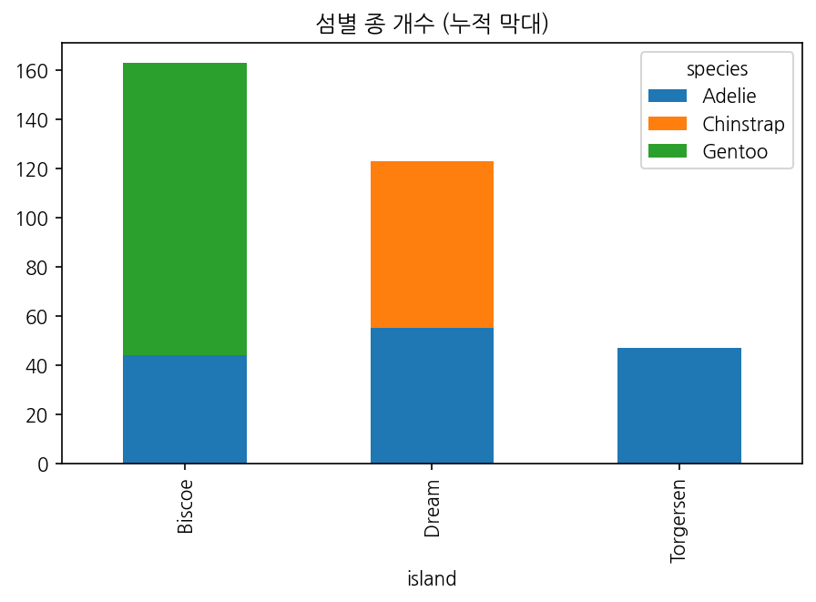

누적 막대그래프는 각 섬의 전체 개체수 중 종별 기여도를 보여주며, 전체 분포에서 종의 비중을 직관적으로 파악할 수 있습니다. 이 시각화는 특정 섬에서의 생태적 균형이나 종 공존 구조를 이해하는 데 도움을 줍니다. 또한 누적형태는 상대 비율을 강조하므로, 절대 수치가 중요한 경우에는 별도의 표(교차표)를 함께 제시하는 것이 바람직합니다.


# 부리 길이 히스토그램 (mm)


# 종별 부리 길이 분포 (히스토그램)

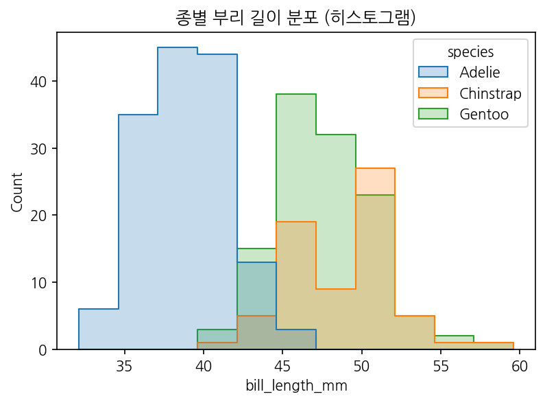

종별 히스토그램을 통해 각 종에서 부리 길이 분포 차이가 명확히 드러납니다. 예컨대 Adelie는 비교적 짧은 부리 쪽에 몰려 있고, Gentoo는 긴 쪽으로 분포가 이동해 있음을 확인할 수 있습니다. 이러한 차이는 먹이 선택이나 먹이 섭취 방식의 차이에 따른 적응적 결과로 해석될 수 있습니다. 또한 분포의 겹침 정도는 종 간 생태적 유사성 또는 측정 분산을 시사합니다. 종 구분이 비교적 명확한 변수로 보이므로, 분류(classification) 모델에서 유용한 피처가 될 가능성이 높습니다. 다만 종 간 표본수 차이를 보정해 비교해야 보다 공정한 결론을 얻을 수 있습니다.


# 종별 지느러미 길이 KDE

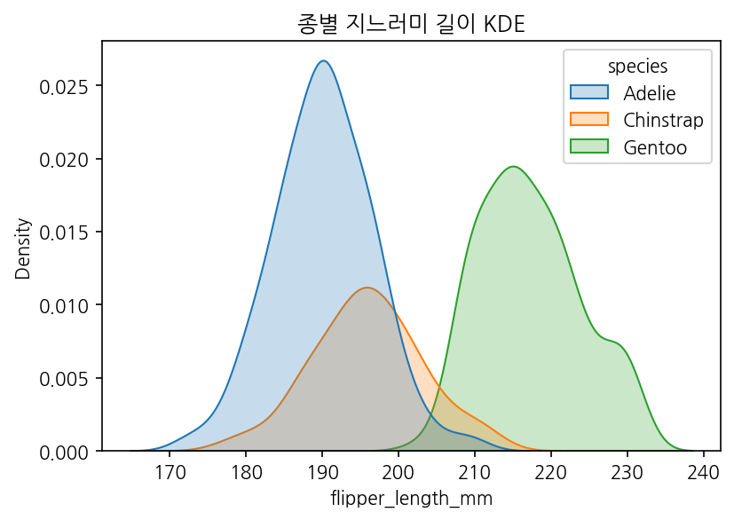

지느러미 길이의 KDE는 종별 지느러미 길이 분포의 연속적 형태를 제공합니다. Gentoo는 장대한 지느러미를 보이는 반면, Adelie는 상대적으로 짧은 값을 중심으로 분포가 형성되어 있어 종간 차이가 지속적으로 관찰됩니다. KDE의 봉우리 위치와 폭은 각 종의 중심 경향과 변이를 나타내며, 겹침이 적은 경우 해당 변수는 종 식별에 도움이 됩니다. 또한 KDE는 이상치의 영향을 완만하게 보여주어 히스토그램보다 부드러운 비교를 가능하게 합니다. 이 결과는 체중과의 상관성 관찰(회귀/상관분석)과 결합하면 생태적 의미를 더 풍부하게 해석할 수 있습니다.


# 종별 부리 길이 박스플롯

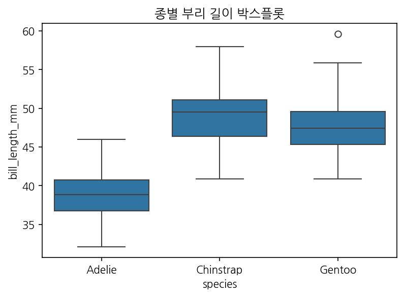

박스플롯은 종별 부리 길이의 중앙값, 사분위수 범위 및 잠재적 이상치를 직관적으로 보여줍니다. 여기서 Gentoo는 높은 중앙값과 넓은 IQR을 보여 체구 및 부리 길이의 변이가 큼을 시사합니다. Adelie는 중앙값이 낮고 IQR이 좁아 집단 내부 변이가 작다는 것을 의미할 수 있습니다. 이상치 점은 개체 수준의 특이한 표본을 나타내며, 생물학적 변이인지 측정오류인지 추가 확인이 필요합니다. 이 플롯은 다양한 그룹 간 분포 비교와 이상치 식별에 유용하며, 통계적 검정(예: ANOVA, Kruskal-Wallis)으로 그룹 차이를 확인할 것을 권장합니다.


# 종별 부리 깊이 바이올린플롯

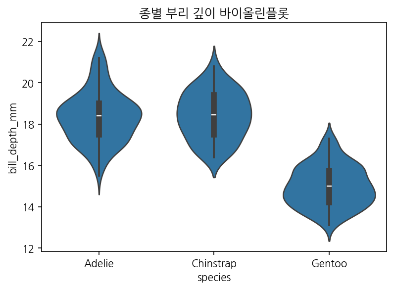

바이올린플롯은 밀도추정과 함께 각 종의 분포 형태를 보여주어 부리 깊이의 전체적인 분포 및 군집도를 파악하기에 유리합니다. 종별로 밀도 모양이 다르다면, 서로 다른 먹이 취득 전략이나 형태적 적응을 반영할 수 있습니다. 예를 들어 특정 종에서 이중봉우리(double peak)가 관찰되면, 두 하위집단(성별 혹은 연령층)에 따른 차이가 존재할 가능성을 시사합니다. 관찰된 분포형태를 바탕으로 추가 군집 분석 또는 혼합분포 모델을 적용하면 더 세부적인 해석이 가능합니다.


